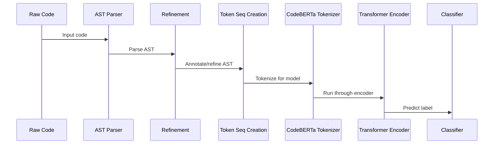
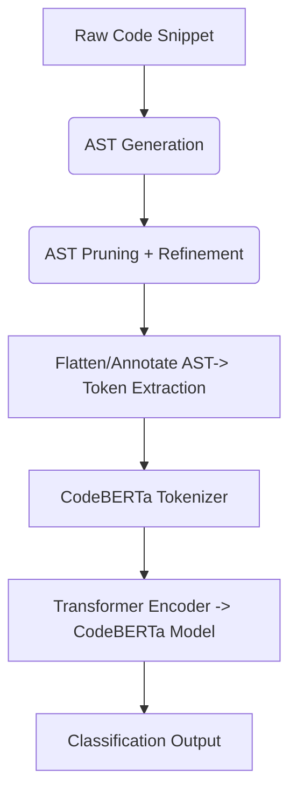

# ⚙️ AlgoD: Code Structure Identification Using CodeBERTa

**AlgoD** is a proof-of-concept project designed to identify high-level code structures (specific algorithmic components) from unseen source code. This repository details an approach that leverages both the structural information of raw code (via its Abstract Syntax Tree, or AST) and a specialized code-aware language model, CodeBERTa, to reliably classify code patterns, particularly when working with small, labeled datasets.

## 📌 Motivation & Background

Machine learning on source code presents unique challenges due to code's rich hierarchical syntax, which goes beyond plain text. Traditional sequence models like RNNs and LSTMs, while capable of mitigating vanishing gradients, treat code as flat token sequences and struggle to capture long-range or nested dependencies (e.g., matching braces, nested loops). Transformers (BERT/GPT) improve on sequence length and parallelism through self-attention but also operate on linear token streams, often missing...

To address these limitations, AlgoD leverages **CodeBERTa**, a RoBERTa-like Transformer pre-trained specifically on large code corpora. CodeBERTa's tokenizer, designed for code (byte-level BPE on GitHub code), encodes code more efficiently (33-50% shorter sequences) than general NLP models. Our small CodeBERTa model (6 layers, 84M parameters), trained from scratch on 2M functions, possesses broad code semantics. By combining AST-based preprocessing with CodeBERTa's embeddings, our approach captures both ...

## 🧠 Why Traditional LLMs Fail for Code

Most language models (RNNs, LSTMs, Transformers) are designed for linear, natural language. Code is hierarchical and syntactic. Traditional models:

- ❌ Ignore control structures (loops, conditionals)
- ❌ Overfit to variable names
- ❌ Can't distinguish semantically similar structures with different tokens

## 💡 Why CodeBERTa?

CodeBERTa is a RoBERTa-like Transformer pretrained on code:

- 🔧 **Code-Optimized Tokenization**: Byte-level BPE tokenizer designed for GitHub code.
- 🔍 **Code Semantics**: Pre-trained on 2M functions capturing syntax and semantics.patterns
- 🤝 **Robustness with Limited Data**: Combines tokenization with ASTs to avoid overfitting.
- 📦 **Integration**: Easy use via HuggingFace `transformers` library.

## 🧩 System Pipeline

### 🎢 Sequence Diagram



### 🧱 Architecture Diagram



## 🧪 Model Architecture & Training

- Model: CodeBERTa-small via `AutoModelForSequenceClassification`
- Task: Multi-class classification (algorithm structure)
- Loss: Cross-entropy with early stopping
- Regularization: Dropout and validation accuracy monitoring

## 🌳 Dataset & Preprocessing

- **Dataset**: `AlgosVersion2.csv` with Java/Python examples and labels.
- **AST Parsing**: Using language-specific tools (e.g. `ast` in Python).
- **Refinement**: Extract loops, conditionals, API calls, variable types.
- **Tokenization**: Combined tokens (AST + code) processed by CodeBERTa tokenizer.

## 🌲 Example AST Snippet

```python
def add(a, b):
    return a + b
```

**AST Structure**:

```
Module
└── FunctionDef (add)
    ├── arguments (a, b)
    └── Return
        └── BinOp (Add)
```

## 🧪 Dataset

| Code Snippet         | Label              |
| -------------------- | ------------------ |
| Recursive Fib()      | Fibonacci          |
| While-based Dijkstra | DijkstraAlgorithm  |
| HashMap BFS          | BreadthFirstSearch |

- File: `AlgosVersion2.csv`
- Format: `code`, `label`

## 📊 Evaluation & Results

- **Model**: CodeBERTa-small
- **Compared against**: BERT, LSTM baselines
- **Task**: Multi-class classification
- **Metrics**: Accuracy, confusion matrix
- **Approach**: Train-test split, accuracy + confusion matrix
- **Result**: CodeBERTa + AST outperforms token-only baselines
- **Future**: Explore AST + DFG, or GraphCodeBERT variants

## 📌 Highlights

- ✅ Focus on real-world structural understanding in code
- 🧠 Uses Abstract Syntax Trees (ASTs) for code parsing and refinement
- 🤖 Fine-tunes CodeBERTa-small for structure classification
- 📉 Designed to work with small, high-quality datasets
- 🔍 Evaluation includes structured metrics and classification insights

## 📁 Folder Structure

```
AlgoD-CodeStructure-Identifier/
├── README.md
├── dataset/
│   └── AlgosVersion2.csv
├── notebook/
│   └── dissertation.ipynb
├── code/
│   ├── ast_parser.py
│   └── model_inference.py
```

## 👤 Author

**Arpan Gupta**  
🎓 MSc AI & Robotics, University of Glasgow  
🔗 [GitHub](https://github.com/Arpangpta) | [LinkedIn](www.linkedin.com/in/apngupta/)
